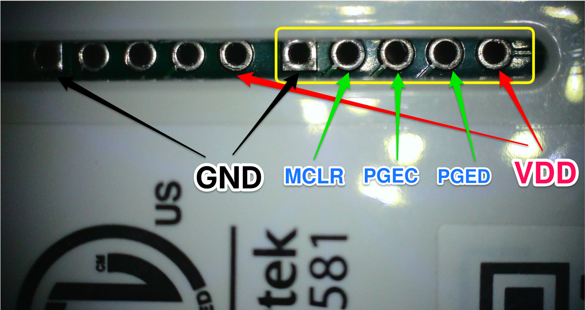

# First-Time Flash Guide

Guide for the initial firmware flash on a Insteon Hub 2245-222 (v2).

## Hardware/Software Prerequisite

### Option 1: Microchip MPLAB Approach

**You need:**

- Hardware: One of  Microchip programmers, such as Pickit 3/4, ICD 4, or Snap
- Software: MPLAB IPE (or MPLAB X)

Pinout of a standard PIC32 ICSP header (6-pin):

| Programmer | Hub Board |
|------------|-------------|
| MCLR | MCLR |
| VDD | 3.3V |
| GND | GND |
| PGD | PGED |
| PGC | PGEC |
| PGM | (Not Connected) |

### Option 2: DIY Approach

**You need:**

- Hardware: RP2040-based board (e.g., Raspberry Pi Pico) w/pic32probe firmware
- Software: pic32prog
  
#### Build DIY PIC32 programmer

Flashes the RP2040 board with the pic32probe firmware to act as a PIC32 programmer. Source code at [github.com/kiffie/pic32probe](https://github.com/kiffie/pic32probe). A prebuilt UF2 is provided at `tools/pic32prog_tools/pic32probe.uf2`.

**pic32 programmer firmware flash instruction:**

1. Hold BOOTSEL on the Pico, connect to USB
2. Copy `pic32probe.uf2` to the Pico (appears as a USB drive)
3. Pico reboots automatically — the probe is ready

Pinout for the prebuilt pic32 programmer firmware:

**Pico → Hub connections:**

| Pico Pin | Function | Hub ICSP Header |
|----------|----------|-------------------|
| GPIO4 | PGD | PGED |
| GPIO6 | PGC | PGEC |
| GPIO3 | !MCLR | MCLR |
| GND  | GND | GND |

#### Build DIY Host tool

Build the `pic32prog` host tool from source at [github.com/kiffie/pic32prog-kvh](https://github.com/kiffie/pic32prog-kvh). A prebuilt Linux binary is provided at `tools/pic32prog_tools/pic32prog`.

## Prepare for Flashing

### ICSP Connector Location



The ICSP header is located on the Hub board as shown above. Refer to the pinout tables in the prerequisite section for your programmer type.

### Powering the Hub for Programming

---
⚠️ **CAUTION: MAINS VOLTAGE**

The Hub 2245-222 power supply connects to mains (line) voltage. This poses a risk of electric shock.

**Always** unplug the power cord before connecting or disconnecting the programmer. Even after unplugging, internal capacitors can retain dangerous voltage — wait at least **30 seconds** before handling the board.

**Do not** touch exposed wires, solder joints, or board traces while the Hub is plugged in. If you are not experienced with mains-powered electronics, use the external 3.3V option below instead.

*Proceed at your own risk.*

---

**Option 1: Use the Hub's own power supply**

Plug the Hub into mains power. The board will be powered through its internal supply.

**Option 2: Supply 3.3V externally**

If you prefer not to use mains power, supply 3.3V directly to the board. The ICSP header has two sets of VDD and GND pins — one pair is used by the programmer, the other pair can be used for an external 3.3V supply. Make sure the external supply can deliver sufficient current (at least 300 mA recommended).

## Backup Current Firmware

Before flashing new firmware, back up the existing firmware from the Hub's PIC32. This allows restoring the original firmware if needed.

### Option 1: MPLAB Approach

Use MPLAB IPE to read the device memory and save to a hex file. Select target device **PIC32MX695F512H** before reading or writing.

### Option 2: DIY Approach

```bash
./tools/pic32prog_tools/pic32prog -r hub_app.bin 0x1d000000 0x80000
./tools/pic32prog_tools/pic32prog -r hub_bl_cfg.bin 0x1fc00000 0x3000
```

This reads 512 KB of program flash starting at address `0x1d000000` into `hub_app.bin`, and the boot config region into `hub_bl_cfg.bin`.

## Flash Custom Hub Firmware

### Option 1: MPLAB Approach

Flash `fw/firmware_full.hex` using MPLAB IPE or your programmer software. Select target device **PIC32MX695F512H** before programming.

### Option 2: DIY Approach

```bash
./tools/pic32prog_tools/pic32prog fw/firmware_full.hex
```

The tool auto-detects the Pico probe via USB. Output should show erase, program, and verify progress.

## Check Custom Hub Firmware is Working

1. Connect Ethernet and power
2. The bridge starts listening on ports **9761** (PLM bridge) and **1984** (command)
3. Verify with:

```bash
echo "version" | nc <ip> 1984
```

Expected response: `v1.x.x (<git_hash>)`

## Backup SPI Flash Contents

The Hub has three SPI flash chips (2 MB each) that store configuration and firmware upgrade data. Back these up to preserve the original contents.

With the custom firmware running, use the bridge's command port (1984) to read each chip:

```bash
python tools/brg-service.py <ip> spi read 0 -r backup_spi0.bin 0x0 0x200000
python tools/brg-service.py <ip> spi read 1 -r backup_spi1.bin 0x0 0x200000
python tools/brg-service.py <ip> spi read 2 -r backup_spi2.bin 0x0 0x200000
```

This reads all 2 MB from each chip (chips 0, 1, 2).

## Troubleshooting

| Symptom | Likely Cause |
|---------|-------------|
| `pic32prog` doesn't find the probe | Pico not flashed with `pic32probe.uf2`, or USB not connected |
| Program fails mid-way | Wiring incorrect — check PGD/PGC/MCLR connections |
| "Device ID mismatch" | Wrong target voltage or MCLR not connected |
| No response on port 1984 | Firmware flashed but Ethernet link not up — check LED |
